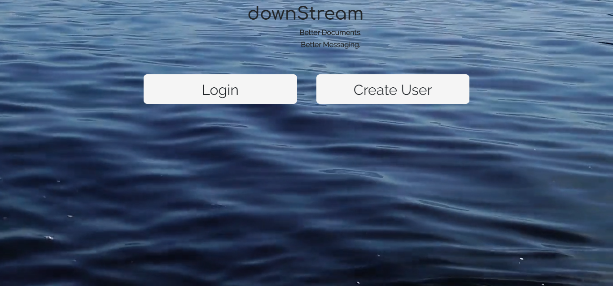

# DownStream

## Collaborators 
- Logan Moody
- Matt Jeffords
- McCabe Northup
-----------------------------------------------------------------------------------------------------------------------

------------------------------------------------------------------------------------------------------------------------
## Summary of Project
- Downstream is a perfect application for any organization looking to communicate through a messaging service that also provides document retention. Downstream provides active messaging (Streams) via one to one users or even group messaging functionality. Downstream also provides a place to upload and store organizational important documents. 

------------------------------------------------------------------------------------------------------------------------
## User Profiles
- Downstream's ideal user would be a Doctor messaging their patients, and a patient messaging back their doctor. This will provide real time messaging between Doctors and Patients as well as providing a place to upload and download patient files, test results, and even billing statements. 

- An additional Downstream user would be a school teacher to students patients group. Operating much like the above user profile, the teacher could message the student's parents in a group or one on one. The teacher could also upload documents such as; report cards, permission slips, and parent teacher information. 

------------------------------------------------------------------------------------------------------------------------
## Dependencies and Major Technologies Used
**AWS S3**
- Using AWS S3 for document (raft storage);
**Passport Authentication**
- Passport authenticates the login, create user, and keeps non users from accessing further routes.
**DropZone.JS**
- DropZone handles our upload functionality to S3
*Other Dependencies*
- Express
- Path
- Express-Session

## Link to Deployed Project
https://calm-wildwood-28573.herokuapp.com/rafts
